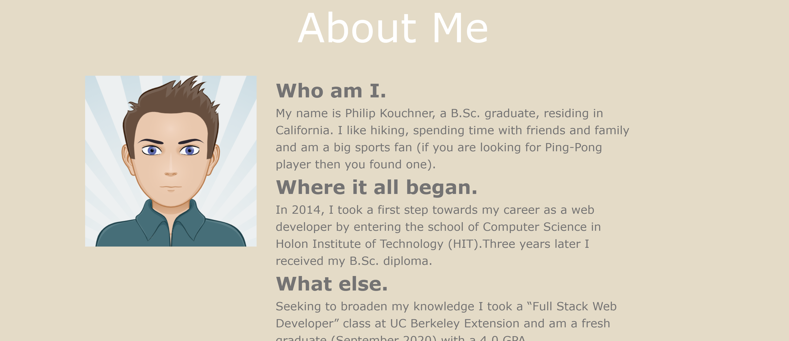

  
  
  
  
  
# Introduction: Portfolio

Recently graduaded from UC-Berkley as a full stack web developer.
 

## Screenshot 

## Built With

- React
- JavaScript
- Node.js - express 

## Authors

- Philip Kouchner 
- Heroku link - https://newportfoilio-app.herokuapp.com/